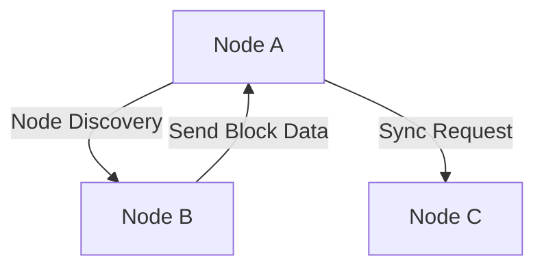

This file explains the fundamental concepts of peer-to-peer (P2P) networking in go-ethereum (geth), exploring its architecture, key components like libp2p and RLP, the discovery protocol, and the challenges faced when designing decentralized network systems.

# How the Peer-to-Peer network works in go-ethereum
## Introduction
### What is go-ethereum (geth)
### What are P2P networks?

## Basic components of the P2P network in Ethereum
### P2P protocols
#### Discovery Protocol (V4 and V5)
#### DevP2P Protocol
### How P2P works in Ethereum

...

## Implementation of P2P in go-ethereum
### Basic architecture
#### libp2p
#### RLP
### The main P2P modules in geth
### Example of Peer Discovery operation

...

## Technical challenges and solutions
### Data Synchronization
### Scalability
### Security
...

## Conclusion
